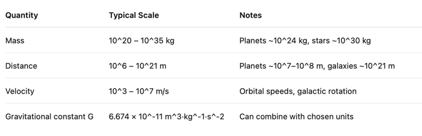

# Double Precision and Number Normalization in Astrophysical Simulations

## 1. Double Precision in C++

- In C++, a `double` is typically a **64-bit IEEE 754 floating-point number**:

  | Field    | Bits | Description                |
  |----------|------|----------------------------|
  | Sign     | 1    | 0 = positive, 1 = negative |
  | Exponent | 11   | Biased exponent            |
  | Mantissa | 52   | Fraction (significand)     |

- Maximum finite `double`: DBL_MAX ≈ 1.7976931348623157 × 10^308
- The spacing between the largest doubles (ULP) is huge: Δ ≈ 2^(1023 - 52) ≈ 2 × 10^292

> Precision is ~16 significant digits, but absolute differences grow very large for extreme numbers.

1. Typical Scales in Astrophysical N-body Simulations

Using raw SI units:
•	Numbers range from 1e-20 to 1e42.
•	Forces may involve subtracting very large numbers, leading to loss of precision if not careful.

⸻

2. Precision Considerations
   •	Double precision provides ~16 decimal digits of relative precision.
   •	At extremely large magnitudes (~1e308), the absolute spacing between representable numbers becomes enormous (~1e292).
   •	This can make very small differences between huge numbers unrepresentable.

⸻

4. Normalization of Simulation Units

To improve numerical stability:
1.	Choose simulation units so that quantities are around order 1:
•	Mass unit: e.g., 1 × 10^30 kg
•	Length unit: e.g., 1 × 10^11 m
•	Time unit: e.g., 1 × 10^5 s
2.	Advantages:
•	Keeps numbers in the 1–1000 range.
•	Reduces risk of catastrophic cancellation.
•	Maintains relative precision across calculations.
3.	Implementation tip:
•	Convert all physical constants and initial conditions to these units before the simulation.
•	Convert back to SI units only for output or analysis.

⸻

Summary:
•	double precision is usually sufficient for N-body simulations if numbers are normalized.
•	Always be mindful of extreme magnitudes and catastrophic cancellation.
•	Using normalized simulation units ensures better numerical stability and precision.